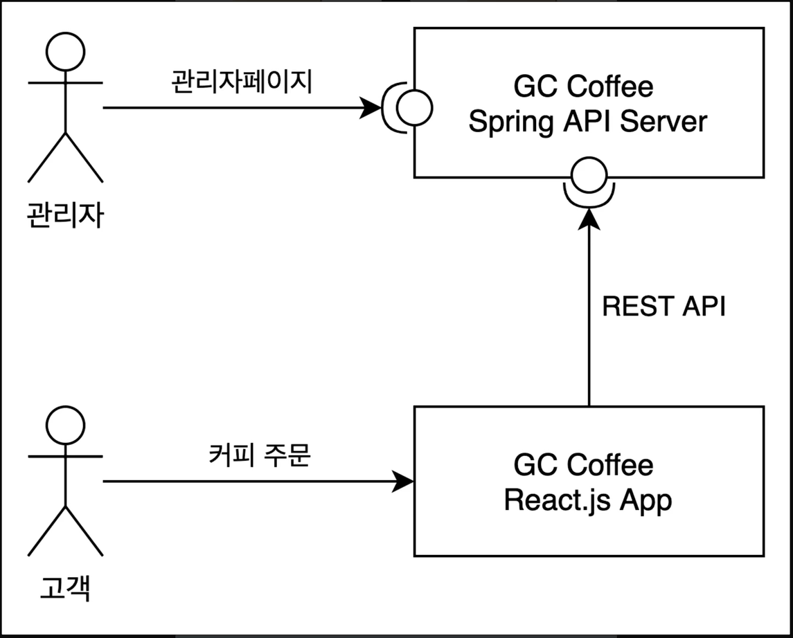

# [클론 코딩] 커피 주문 관리 시스템

[프로젝트] React - Spring Boot 상품 관리 API 구현

## 프로젝트 소개

React로 만들어진 Front End가 정해져있는 상황에서, 백엔드 개발자가 Spring Boot로 상품관리 API를 구현하여 최종 서비스를 완성시켜본다.

___

### 프로젝트 목적 💻

로컬 카페 `Grids & Circles`의 Coffee Bean package 온라인 주문 웹 사이트를 제작한다.

### 프로젝트 환경 🎈

1. BackEnd
   - `Spring Boot`, `Thymeleaf`, `Java`
2. FrontEnd
   - `React`, `Node.js`, `Javascript`

### 시스템 구성도 🔧

### 요구 사항 📋

- 별도로 회원을 관리하지 않는다.
   - 주문을 받을 시에 email을 같이 받는다.
- 프론트엔드와 서버는 REST API로 소통한다.

1. 관리자
   - 주문을 관리하는 관리자 페이지
2. 고객
   - 커피 주문을 하는 웹 페이지

### 구현 내용 📜

1. Product
   - 제품 리스트 조회 페이지
   - 제품 생성 기능 및 페이지

2. Order
   - 주문 생성 api
   - 주문 관리 페이지
